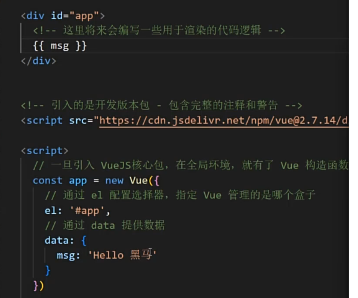

# Day1

## 基础概念

### vue是什么

用于<u>构建用户界面</u>的<u>渐进式</u>框架（基于数据动态渲染界面）

#### 官网文档链接：[介绍 — Vue.js (vuejs.org)](https://v2.cn.vuejs.org/v2/guide/)

### 两种使用方式

1. vue核心包开发

   场景：局部模块改造

2. 利用构建工具开发（webpack/vite）

   场景：整站开发

## 快速上手

### 1. 构建实例

#### 核心步骤：

1. 准备容器
2. 引包（开发版本（包含完整注释和警告）/生产版本）
3. 创建vue实例 const app = new Vue({})
4. 指定配置项->渲染数据
   * el指定挂载点
   * data提供数据



### 2. 插值表达式

* 一种vue的模板语法

1. 作用：利用表达式（可以被求值的代码）进行插值，渲染到页面中
2. 语法：`{{ 表达式 }}`

### 3. 响应式（vue核心特性之一）

* 数据变化，视图自动更新

### 4. 开发者工具

* Google插件：vue develop tool

## 指令

### 1.v-html

* 功能：解析标签
* 

### 2. v-show

* 功能：控制元素显示隐藏（本质切换display）
* 语法：`v-show="ture/false"`
* 场景：频繁切换显示隐藏的场景

### 3. v-if

* 功能：条件渲染（控制元素创建和移除）
* 语法：`v-if="ture/false"`

### 4. v-else  v-else-if

* 功能：辅助v-if进行判断渲染
* 

### 5. v-on

* 功能：注册事件 （添加监听+提供处理逻辑）

* 语法：

  1. `v-on:事件名='内联语句'` 可以简写为`@事件名='内联语句'`
  2. `v-on:事件名="methods中的函数名"`

* 

* v-on调用传参

  

### 6. v-bind

* 功能：动态设置html的标签属性（src、url、title...）
* 语法：`v-bind:属性名="表达式"` 可简写为`:属性名="表达式"`

### 7. v-for

* 功能：基于数据循环，多次渲染整个元素
* 语法：`v-for="(item,index) in 数组"`
* key属性：唯一标识

### 8. v-model

* 功能：给表单元素使用，双向数据绑定->可以快速获取或设置表单元素（数据变化<=>视图更新）
* 语法：`v-model='变量'`

# Day2

## 指令补充

### 指令修饰符

* 按键修饰符

  `@keyup.enter`：键盘回车监听

* v-model修饰符

  `v-model.trim`：去除首尾空格

  `v-model.number`：转数字

* 事件修饰符

  `事件名.stop`：阻止冒泡

  `事件名.prevent`：阻止默认行为

### 样式控制

1. v-bind操作class

* 语法：

  `:class="{ 类名1：布尔值，类名2：布尔值 }"`

  `:class="[ 类名1，类名2，类名3]"`

2. v-bind操作style

* 语法：

  `:style="样式对象"`

## 计算属性

### 概念

基于现有的数据计算出来的新属性。数据变化时自动重新计算。声明在computed配置项中，使用时用`{{}}`


* 和method的区别：
  * method作为方法需要调用
  * computed作为属性直接使用

### 优点：

缓存特性（提升性能）（会对计算出来的结果缓存，再次使用直接读取，直到依赖项改变）

### 完整写法：


## watch监听器

* 作用：监视数据变化

### 语法：

* 简单写法：

  

  （参数oldvalue不用时，可省略）

* 完整写法：添加额外配置项

  1. `deep:ture` 对复杂类型深度监视
  2. `immediate:ture` 初始化立刻执行一次haandler方法 

  

# Day3

## vue生命周期

### 概念：

* 一个vue实例从创建到销毁的整个过程

### 四个阶段：

1. 创建：数据响应式处理
2. 挂载：渲染模板
3. 更新：数据修改，更新视图（可循环）
4. 销毁：销毁实例

### 生命周期函数（钩子函数）

vue生命周期过程中，会自动运行一些函数，被称为【生命周期钩子】，让开发者可以在特定阶段运行自己的代码。


* mounted才可以操作dom

### 小黑记账本案例

1. 基本渲染
   * 利用created请求数据（封装渲染方法以便更新数据后使用）
   * 数据更新给data：`this.list = res.data.data`
   * 动态渲染
2. 添加功能
   * `v-model`收集表单数据，添加点击事件，编写添加函数，重新渲染
3. 删除功能
   * 添加点击事件，编写带参删除函数，重新渲染
4. 饼图渲染
   * mounted初始化echarts实例，渲染函数中利用setOption动态更新饼图（map函数

## 工程化开发入门

### 脚手架vue CLI

* 官方提供的一个**全局命令工具**

* 功能：快速创建一个开发vue项目的标准化基础架子（集成了webpack配置

* 优点：开箱即用、内置babel等工具、标准化

* 使用步骤：

  

### 脚手架目录文件介绍


* main.js作用：导入App.vue，基于App.vue创建结构渲染index.html

### 组件化开发

* 组件化：一个页面拆分成多个组件，每个组件有自己独立的结构、样式、行为。

* 优点：便于维护，利于复用

* 根组件：整个应用最上层的组件，包裹所有组件
  * 结构<template>
  * 样式<style>
  * 行为<script>

### 普通组件的注册使用

1. 局部注册：只能在注册的组件内使用

   * 在components文件夹中创建.vue文件（包含结构、样式、行为三部分）

   * 在使用的组件内导入并注册：

     ```js
     //导入
     import 组件对象 from '.vue文件路径'
     
     //注册
     export default {
     	//局部注册
     	components:{
     		'组件名': 组件对象，
     }
     ```

2. 全局注册：所有组件内都能使用

   * 在components中创建.vue文件

   * main.js中进行全局注册

     ```js
     /导入
     import 组件对象 from '.vue文件名'
     
     //注册
     export default {
     	//局部注册
     	Vue.component('组件名': 组件对象)
     ```


> Ctrl+k，Ctrl+0  当前文件代码全部折叠

# Day4

## 组件三大组成部分（结构样式逻辑）

### 1. 注意点

1. `template`中只能有一个根元素

2. `style`分为全局样式（默认）和局部样式（给`style`标签加上scoped属性）

3. `script`中`el`是根实例独有，一个组件的data选项必须是一个函数：(为了保证每个组件实例，维护独立的一份数据)

   ```js
   data() {
   	return {
   		count:100
   	}
   },
   ```

## 组件通信

* 组件的数据是独立的，无法直接访问其他组件的数据

### 组件关系

1. 父子关系
2. 非父子关系

### 组件通信解决方案

1. 父子关系：`props`和`$emit`

   * 父传子`props`：

   

   * 子传父`$emit`:

   

2. 非父子关系：

   （1）`provide ` & `inject`

   （2）`eventbus`

3. 通用解决方案：Vuex（适合复杂业务场景）

### prop

* 定义：组件上注册的一些自定义属性
* 作用：向子组件传递数据

### prop校验

* 作用：为组件的prop指定验证要求，不符合要求，控制台就有错误提示

* 语法：

  1. 类型校验

     ```js
     props: {
     	校验的属性名：类型
     }，
     ```

  2. 非空校验

  3. 默认值

  4. 自定义校验

     ```js
     props: {
       校验的属性名:{
     	type: 类型,
     	required: true, //是否必填
     	default: 默认值,
     	validator(value) {
     	//自定义校验逻辑
             if(条件){
             return true
             } else {
               return false
             }
     	}
       }
     },
     ```

### prop & data

* 共同点：都可以给组件提供数据

* 区别：

  * data数据是自己的，随便改
  * prop数据是外部的，不能直接改，要遵循**单向数据流**

  ##### 单向数据流

  父级的prop的数据更新，会向下流动，影响子组件。这个数据流动是单向的

### 非父子通信

#### 1. event bus事件总线

* 作用：非父子组件之间，进行简易消息传递

* 用法：

  1. 创建一个都能访问到的事件总线 （空vue实例） 放在utils/EventBus.js文件

     ```js
     import Vue from 'vue'
     const Bus = new Vue()
     export default Bus
     ```

  2. 接收方组件 监听Bus实例的事件

     ```js
     created () {
         Bus.$on('sendMsg', (msg) => {
             this.msg = msg
         })
     }
     ```

  3. 发送方组件 触发Bus实例的事件

     ```js
     Bus.$emit('sendMsg', '这是一个消息')
     ```

#### 2. provide & inject

* 作用：跨层级共享数据

* 用法：

  1. 父组件provide提供数据

     ```js
     export default {
       provide () {
         return {
             //普通类型【非响应式】
             color: this.color,
             //复杂类型【响应式】
             userInfo: this.userInfo,
         }
       }
     }
     ```

  2. 子/孙组件inject取值使用

     ```js
     export default {
       inject: ['color', 'userInfo'],
       created () {
         console.log(this.color, this.userInfo)
       }
     }
     ```

## 进阶语法

### v-model详解

* 原理：本质上是一个语法糖。例如应用在输入框相当于value属性和input事件的合写
* 作用：提供数据的双向绑定
  1. 数据变，视图变 （`:value="msg"`）
  2. 视图变，数据变 （`@input="msg =$event.target.value"`）

### 表单类组件封装&v-model简化代码

#### 表单类组件封装

1. 父传子：父组件`props`传递数据，v-model**拆解**绑定数据

   ```js
   //template
   <select :value="cityId" @change="handleChange">...</select>
   
   //script
   props: {
     cityId: String
   },
   methods: {
     handleChange (e) {
       this.$emit('事件名', e.target.value)
     }
   }
   ```

2. 子传父：监听输入，子组件传值给父组件修改

   ```js
   <BaseSelect :cityId="selectId" @事件名="selectId=$event" />
   ```

#### v-model简化代码

* 父组件利用v-model实现子组件和父组件数据双向绑定

1. 子组件中：props通过**value** 接收，事件触发**input**（value和input是固定的）

   ```js
   //template
   <select :value="value" @change="handleChange">...</select>
   
   //script
   props: {
     value: String
   },
   methods: {
     handleChange (e) {
       this.$emit('input', e.target.value)
     }
   }
   ```

2. 父组件中：v-model给组件直接绑数据

   ```js
   <BaseSelect v-model="selectId"></BaseSelect>
   ```

### .sync修饰符

* 作用：实现子组件与父组件的双向绑定

* 特点：prop属性名可以自定义（非固定为value）

* 用法：

  * 父组件

    ```js
    <BaseDialog :visible.sync="inShow" />
    
    //相当于下方代码
    //<BaseDialog //:visible="inShow" //@update:visible="isShow 
    // =$event" />
    ```

  * 子组件

    ```js
    props: {
      visible: Boolean
    },
    this.$emit('update:visible',false)
    ```

### ref 和 $refs

* 作用：获取dom元素或组件实例

* 特点：查找范围为当前组件内（相较于`document.querySelector`更精确稳定）

* 用法：

  * **获取 dom**：

  1. 目标标签添加ref属性

     ```html
     <div ref="chartRef">
       渲染的dom
     </div>
     ```

  2. 渲染完后，通过`this.$refs.xxx`获取目标标签

     ```js
     mounted () {
       console.log(this.$refs.chartRef)
     },
     ```

  * **获取组件**：

  1. 目标组件添加ref属性

     ```html
     <BaseForm ref="baseForm"></BaseForm>
     ```

  2. 渲染完后，通过`this.$refs.xxx`获取目标组件，再调用组件方法

     ```js
     this.$refs.BaseForm.组件方法（）
     ```

### $nextTick

* 功能：等dom更新后，才会触发执行此方法里的函数体

* 语法：`this.$nextTick(函数体)`

# Day5

## 自定义指令

### 概念

* 自己定义的指令，可以封装一些dom操作，拓展额外功能

### eg:自动获取焦点指令

1. 注册指令：

   * 全局注册

     ```js
     Vue.directive('focus',{
       //insert会在 指令所在的元素被插入到页面中时触发
       inserted(el) {
         //el就是指令所绑定的元素
         el.focus
       }
     })
     ```

   * 局部注册

     ```js
     directives: {
       //指令名：指令配置项
       focus: {
         inserted(el) {
         //el就是指令所绑定的元素
         el.focus
         }
       }
     }
     ```

2. 使用指令：`v-focus`

### eg：自定义指令传值

1. 使用等号绑定具体的参数值：`v-color="color"`

2. 通过`binding.value`拿到指令值，指令值修改会触发update函数

   ```js
   directives: {
     //指令名：指令配置项
     color: {
       //inserted元素被添加到页面时触发
       inserted(el, binding) {
       //el就是指令所绑定的元素
       el.style.color = binding.value
       },
       //update修改元素时触发
       update(el, binding) {
         el.style.color = binding.value
       }
     }
   }
   ```
   

### v-loading指令封装

实现：

1. 准备一个loading类，通过伪元素定位，设置宽高，实现蒙层

   ```css
   .loading:before {
     content: '';
     position: absolute;
     left: 0;
     top: 0;
     width: 100%;
     height: 100%;
     background: #fff url('./loading.gif') no-repeat center;
   }
   ```

2. 开启关闭loading状态，本质就是添加移除类

   ```js
   <div class="box" v-loading="isLoading">
   ...
   </div>
   
   //script
   directives:{
       loading:{
         inserted (el, binding) {
           binding.value ? el.classList.add('loading') : el.classList.remove('loading')
         },
         update (el, binding) {
           binding.value ? el.classList.add('loading') : el.classList.remove('loading')
   
         }
       }
     }
   ```

3. 结合自定义指令的语法进行封装复用

## 插槽

### 默认插槽

* 作用：让  
* 语法：
  1. 组件内部需要自定义的结构部分，改用`slot`标签占位
  2. 使用组件时`MyDialog`标签内部传入结构替换`slot`
* 插槽默认值：在`slot`标签内放置

### 具名插槽

* `slot`标签name属性起名字区分
* template配合`v-slot:插槽名`分发内容（可以简化成`#插槽名`

### 作用域插槽

* 特点：定义slot插槽的同时，可以传值。给插槽上绑定数据将来使用组件时使用
* 使用场景：封装表格组件
* 使用步骤：
  1. slot标签以添加属性的方式传值
  2. 所有属性都会被自动收集到一个对象中
  3. template包裹自定义的插槽内容，通过`#插槽名="obj"`接收

## 路由 

### 单页应用程序SPA（Single PageApplication)

* 所有功能在一个html页面上实现

* 

  （SEO：搜索引擎优化）

* 单页：系统类网站、内部网站、文档类网站、移动端站点

* 多页：公司官网、电商类网站

### 路由

生活中：设备和ip的映射关系

vue中：路径和组件的映射关系

### VueRouter插件（vue官方路由管理器包）

* 作用：修改地址栏路径时，切换显示匹配的组件

* 官网： https://v3.router.vuejs.org/zh/

* 使用（5+2）：

  1. 下载VueRouter（vue2下载版本3.6.5，vue3下载版本4.x）

     `yarn add vue-router@3.6.5`

  2. 引入

     `import VueRouter from 'vue-router'`

  3. 安装注册

     `Vue.use(VueRouter)` (插件初始化)

  4. 创建路由对象

     `const router = new VueRouter()`

  5. 注入，将路由对象注入到new Vue实例中，建立关联

     ```js
     new Vue({
       render: h => h(App),
       router   //router：router的简写
     }).$mount('#app')
     ```

  6. 创建需要的组件（views目录），配置路由规则

     

  7. 配置导航，配置路由出口（路径匹配的组件显示的位置）

     

### 组件分类

* 页面组件：放在views目录中
* 复用组件：放在components目录

# Day6

## 路由进阶

> 用“@”代替src目录位置引入组件
>
> eg: @/veiws/...

### 路由的封装抽离 

* 优点：拆分模块，利于维护

### 声明式导航-导航链接

* 功能：实现导航高亮效果

  

* 特点：能跳转、能高亮（自带激活时的类名）

* 高亮类名：

  1. `router-link-active`：模糊匹配（路径后的子路径也可以匹配高亮）
  2. `router-link-exact-active`：精确匹配

* 自定义高亮类名：

  

### 声明式导航-跳转传参

#### 1. 查询参数传参

* 语法：`to="/path?参数名=值"`
* 对应页面接收参数：`$route.query.参数名` （js里面前面加`this.`）

#### 2. 动态路由传参

* 配置动态路由

  

* 配置导航链接

  `to="/path/参数值"`

* 接收

  `$route.params.参数名`（js里面前面加`this.`）

##### 动态路由参数可选符

动态路由必须传参数，否则显示未匹配到组件。      如果不传参数也想匹配，可以在后面加一个可选符`？`

### 路由重定向

网页打开后，默认路径是/路径

* 重定向：匹配path后，强制跳转path路径
* 语法：`{path: 匹配路径，redirect: 重定向到的路径}`

### 404

路径找不到匹配时，给个提示页面

* 位置：配在路由最后
* 语法：`path:"*",component: NotFound`

### 模式设置

* hash路由（默认）：带#
* history路由（常用）：不带#，上线后需要服务端支持
* 语法：

### 基本跳转

1. path路径跳转：注册点击事件后，`this.$router.push('路由路径')`

2. name命名路由跳转（适合path路径太长）

   给路径加一个name，然后`this.$router.push({name: '路由名'})`

### 编程式导航：路由传参

1. path路径跳转 传参：

   * query传参：

     

     接收参数：`$route.query.参数名`

   * 动态路由传参：

     

     接收参数：`$route.params.参数名`

2. name命名路由跳转 传参：

   * query传参：

     

     接收参数：`$route.query.参数名`

   * 动态路由传参：

     

     接收参数：`$route.params.参数名`

## 综合案例

### 组件缓存keep-alive

* 概念：
  * vue的内置组件，当它包裹动态组件时，会缓存不活动的组件实例，而不是销毁他们。
  * 是一个抽象组件，自身不会渲染成一个dom元素，也不会出现在父组件链中。
* 优点：组件切换过程中，把切换出去的组件保留在内存中，防止重复渲染dom；减少加载时间及性能消耗，提高用户体验性。
* 属性：
  1. `include：组件名数组`：只有匹配的组件会被缓存。
  2. `exclude：组件名数组`：任何匹配的组件都不会被缓存。
  3. `max`：最多可以缓存多少组件实例。
* 触发的钩子函数
  1. activated函数：组件被激活时触发（进入页面时
  2. deactivated函数：组件不被使用的时候触发（离开页面时）

# 企业化项目

## 自定义创建项目（基于VueCli）

### 1. 创建项目后选择自定义

* 自定义features

  * Babel：语法降级
  * Router：路由配置
  * Linter/Formatter：ESlint代码规范

* 选择CSS预处理器

  

* 选择ESlint规范

  

  * ESlint + Standard config：无分号规范（标准化）

* 保存时校验

  

* 将配置文件放在哪里

  

## vuex概述

* 概念：vuex是一个vue的状态管理工具（大白话：vuex是一个可以管理vue通用的数据（多组间共享的数据）的插件）
* 应用场景：
  1. 某个状态在很多个组件使用
  2. 多个组件共同维护一份数据

### 创建一个vuex空仓库

1. 安装vuex（自定义创建时勾了vuex就不用安装了）

   `yarn add vuex@3`

2. 新建vuex模块文件

   在store/index.js存放vuex

3. 创建仓库

   `Vue.use(Vuex)`

   创建仓库`new Vuex.store()`

4. 在main.js中导入挂载到Vue实例上

### 仓库数据的提供和使用

* 提供数据：`state:{}`

* 使用数据：

  1. store直接访问：

     

  2. 通过辅助函数访问

     mapState把store中的数据自动映射到组件的计算属性中

     

### mutations

> vuex同样遵循单向数据流，组件中不能直接修改仓库的数据
>
> `strict:true`开启严格模式

1. 定义mutations对象

   

2. 组件中提交调用mutations

   `this.$store.commit('addCount')`

3. 提交mutations传参（有且只能有一个参数，多参数可以包装成对象或数组）

   

4. mutation输入框双向绑定：

   * `:value`输入框内容渲染
   * `@input`监听输入获取内容
   * 封装mutation处理函数
   * 调用传参

#### 	mapMutations

* 作用：把位于mutations中的方法提取了出来，映射到组件methods中

* 用法：

  1. 定义mutation

     

  2. 映射到methods中

     

     ↑等价于↓

     

### actions

* 处理异步操作

1. 提供actions方法

   

   > 相当于给mutations包了一个异步处理器

2. 页面中调用

   `this.$store.dispatch`

#### 	mapActions

* 作用：把位于actions中的方法提取出来，映射到组件methods中

* 用法：

  

### getters

> 类似于计算属性
>
> 除了state外，有事我们需要从state中派生出一些状态，这些状态时依赖state的，此时会用到getters

1. 定义getter：

   

2. 访问：

   * 通过store访问

     `this.getters.filterList`

   * 通过辅助函数

     

### 模块module（进阶语法）

#### 	模块拆分：

* 放在store/modules/下

  

* 在store/index.js中导入挂载

  

#### 	使用

* 调用state

  1. 通过模块名访问state中数`$store.state.模块名.xxx`

  2. 通过mapState映射

     ·默认级别映射`mapState(['xxx'])`

     ·子模块映射 `mapState('模块名',['xxx'])`    ----需要开启命名空间

* 调用getters

  1. 直接访问

     `$store.getters['模块名/xxx']`

  2. mapGetters映射

     ·默认级别映射`mapGetters(['xxx'])`

     ·子模块映射 `mapGetters('模块名',['xxx'])`    ----需要开启命名空间

* 调用调用mutation

  > ​	默认模块中的mutation和action会被挂载到全局，需要开启命名空间，才会挂载到子模块。

  1. 直接访问

     `$store.commit('模块名/xxx',额外参数)`

  2. mapMutations映射

     ·默认级别映射`mapMutations(['xxx'])`

     ·子模块映射 `mapMutations('模块名',['xxx'])`    ----需要开启命名空间

* 调用action

  1. 直接访问

     `$store.dispatch('模块名/xxx',额外参数)`

  2. mapActions映射

     ·默认级别映射`mapActions(['xxx'])`

     ·子模块映射 `mapActions('模块名',['xxx'])`    ----需要开启命名空间

